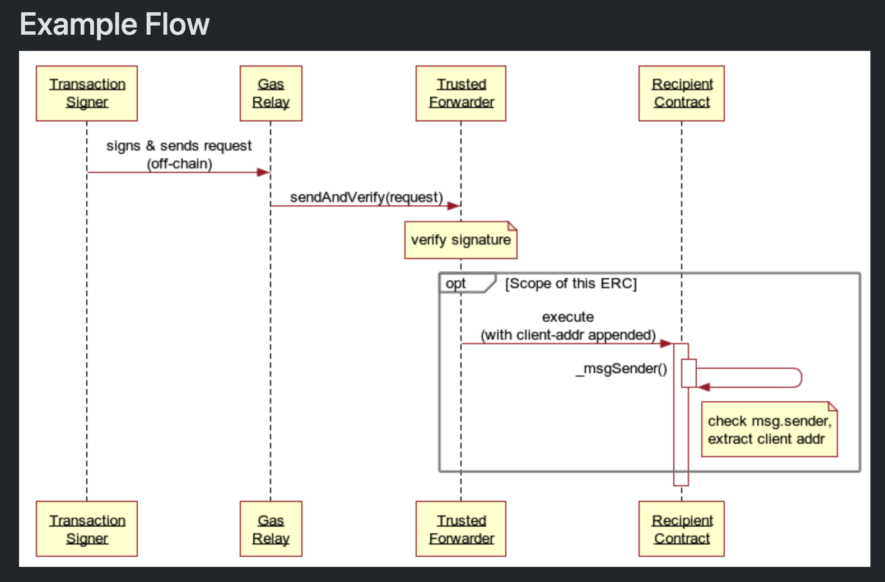

# MetaTXS

This repository demonstrates a **basic meta-transaction** setup using a **Solidity contract** (`ERC721MetaTx.sol`) and **Java client code** (`clientCode.java`) for off-chain signing.

## Overview

A “meta-transaction” is a pattern that allows a user to request an on-chain action **without** directly paying gas- the desired function is encoded together with the data wanted from the request. In this example:

1. The user **signs** their request off-chain (using their private key in Java).
2. The signed data is **forwarded** by a relayer or another trusted party (not shown here) that actually executes the transaction on-chain, paying the gas.
3. The contract (`ERC721MetaTx`) verifies the signature in `executeMetaTransaction(...)` and, if valid, calls the desired function (`mintToken(...)`).

Because the user only **signs** a message off-chain, they never need to hold the network’s native currency to cover gas fees.

---

## Folder Structure

```
metaTX/
├── ERC721MetaTx.sol
└── clientCode.java
```

- **`ERC721MetaTx.sol`**: A simplified Solidity contract that supports meta-transactions.  
- **`clientCode.java`**: Java code using Web3j to generate and sign the meta-transaction data off-chain.

---

## Contract: `ERC721MetaTx.sol`

### Key Components

1. **`executeMetaTransaction(...)`**  
   - Recovers the signer from the off-chain signature using `ecrecover`.
   - Checks that the signer matches `userAddress`.
   - Executes the function call (e.g., `mintToken`) by calling `address(this).call(...)`.

2. **`mintToken(...)`**  
   - Only callable via the `executeMetaTransaction(...)` method.
   - Updates internal mappings to record ownership of an NFT (ERC-721 style).

3. **`toEthSignedMessageHash(...)`**  
   - Mimics the Ethereum signed message prefix: `"\x19Ethereum Signed Message:\n32"`.
   - Used to match the `signPrefixedMessage(...)` logic on the Java side.

### Simplified Flow

1. The contract expects an off-chain signature that includes:
   - `userAddress` (the signer’s address).
   - `functionSignature` (the raw function call data).
   - `block.chainid` (to prevent replay on different chains).
2. If the signature is valid, it calls `mintToken(...)` internally.

---

## Java Client Code: `clientCode.java`

### Purpose

- Demonstrates how to **encode** the function call (in this case, `mintToken(address,uint256)`).
- **Hashes** the data along with `userAddress` and `chainId`.
- **Signs** that hash **off-chain** using the user’s private key.
- **Prints** out the signed components (`r`, `s`, `v`) and the encoded call data.

- Photo taken from the EIP2771 from- <https://eips.ethereum.org/EIPS/eip-2771>


### Dependencies

- **Web3j** (e.g., version 4.x)
- Standard Java libraries (`java.io`, `java.math`, etc.)

### Key Steps in `main(...)`

1. **Setup**  
   - Specify `toAddress`, `chainId` (e.g., 137 for Polygon).
   - Create `Credentials` from user’s private key (`Credentials.create("<PRIVATE_KEY>")`).

2. **Encode `mintToken(...)`**  

   ```java
   Function mintFunction = new Function(
       "mintToken",
       Arrays.asList(new Address(toAddress), new Uint256(tokenId)),
       Collections.emptyList()
   );
   String functionSignature = FunctionEncoder.encode(mintFunction);
   ```

3. **Compute the Hash**  
   - Convert `userAddress` to bytes.
   - Convert `functionSignature` to bytes.
   - Convert `chainId` to a 32-byte padded value.
   - Concatenate these byte arrays.
   - Apply `Hash.sha3(...)` to produce a Keccak-256 hash.

4. **Sign the Hash** 

   ```java
   Sign.SignatureData signature = Sign.signPrefixedMessage(hash, userCredentials.getEcKeyPair());
   ```

   - Uses the same prefix logic as `toEthSignedMessageHash` in Solidity.

5. **Extract and Print `r`, `s`, `v`**  
   - `r`, `s`, and `v` are printed or placed into a JSON payload for forwarding to the relayer (not shown).

### Why “Prefixed” Signing?

- The contract uses `toEthSignedMessageHash(...)` to protect against replay attacks outside Ethereum.  
- `signPrefixedMessage(...)` on the Java side matches that same prefix: `"\x19Ethereum Signed Message:\n32"`.

---

## Usage

1. **Compile/Deploy the Contract**
   - Deploy `ERC721MetaTx.sol` on your chosen network (e.g., Polygon).
   - Note the deployed contract address.

2. **Adjust Java Code**
   - In `clientCode.java`, update `<PRIVATE_KEY>` with a valid user private key.
   - Update `toAddress`, `chainId`, etc., as needed.
   - Ensure the function name (`mintToken`) matches your contract’s function.

3. **Run the Java Program**
   - `javac clientCode.java` (with Web3j in the classpath).
   - `java clientCode`.

4. **Observe Output**
   - The console prints:
     - Signed transaction components (`r`, `s`, `v`).
     - The `functionSignature`.
     - The `userAddress`.
   - These values are then typically **sent to a relayer** (not shown here) that calls `executeMetaTransaction(...)` on your contract.


# Questions-


When you do meta-transactions, you need the user (the real sender) to sign **specific data** off-chain, and later you verify on-chain that the signature corresponds to that same user. Including the `userAddress` in the hashed data is actually **part of the security**. It ensures that:

1. The **signer** knows they are signing “I, \(userAddress\), want to execute \(functionSignature\) on chain \(block.chainid\).”  
2. The signature **only** recovers to that `userAddress` if the **private key** for that address signed it.  

In other words, the user can’t produce a valid signature unless they own the private key of `userAddress`. If someone tries to “plant” a different address in the data, they won’t be able to generate a valid `v, r, s` that recovers to that other address.

---

## Why We Include `userAddress` in the Hash

When you run:

```solidity
bytes32 hash = keccak256(
    abi.encodePacked(userAddress, functionSignature, block.chainid)
);
address signer = ecrecover(toEthSignedMessageHash(hash), v, r, s);
require(signer == userAddress, "Signer and userAddress do not match");
```

- The user (off-chain) signs the exact message:  
  \(\big\{userAddress + functionSignature + block.chainid\big\}\)
- You recover that signature on-chain and verify that the recovered address is the same as `userAddress`.
- If the user didn’t actually own `userAddress`, they **cannot** produce a valid signature that recovers to that address.  

Effectively, you are **binding** the user’s address to the call being made. This prevents scenarios like:

> “I take your `v, r, s` but change the address or function data under the hood.”

Because the signature itself now covers (i.e., includes) the `userAddress`, the function call data, and chain ID. You can’t just swap them without invalidating the signature.

---

## “Doesn’t This Just Plant the Address?”

Yes, you **do** “plant” the `userAddress` into the hash—**but** you can only produce a valid signature (`v, r, s`) if you actually own the private key for `userAddress`. Anyone else trying to fake it cannot generate a matching signature. 

- If the user tries to put someone else’s address in there, they have no way to produce a valid signature that recovers to that address’s private key.  
- On-chain, `ecrecover` only yields the correct `address` if it mathematically matches the signature. If it mismatches, the `require` fails.

---

## Sub-Summary

- **Including `userAddress`** in the data to sign is **exactly the point** of metatransactions: you prove that **that** address initiated (and approved) the call.  
- You must know what data was signed by the user to validate it. The user explicitly signs a message “I, \(this address\), approve function X on chain Y.”  
- When you do `ecrecover(...)`, you’re checking that the signature belongs to the same address that was declared in the message. If the user can’t produce a signature from that private key, it fails.  

That’s how we guarantee that the user who claims to be `userAddress` is actually in control of `userAddress`.

---

## Summary

- **`ERC721MetaTx.sol`** uses `executeMetaTransaction` to allow meta-transactions.
- **`clientCode.java`** shows how to **encode** and **sign** the data off-chain, without paying gas directly.
- This pattern allows users to interact with the contract without holding the native token to pay fees—**the relayer** (not included here) would pay those fees on their behalf.
